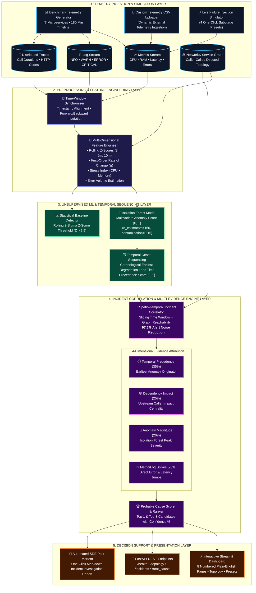

# RootIQ – AI-Powered Root Cause Analysis and Incident Intelligence

[](https://github.com/BijinVarghese/RootIQ-AI-Powered-Root-Cause-Analysis-and-Incident-Intelligence/actions/workflows/ci.yml)
[](https://github.com/BijinVarghese/RootIQ-AI-Powered-Root-Cause-Analysis-and-Incident-Intelligence)
[](https://www.python.org/downloads/)
[](https://streamlit.io/)
[](https://scikit-learn.org/)
[](https://opensource.org/licenses/MIT)
[](https://bijinvarghese-rootiq-ai-powered-root-cause-analysis--app-dvbsel.streamlit.app/)

> 🚀 **Live Production Deployment:** [Launch RootIQ on Streamlit Cloud](https://bijinvarghese-rootiq-ai-powered-root-cause-analysis--app-dvbsel.streamlit.app/)  
> 🔗 **Official GitHub Repository:** [BijinVarghese/RootIQ-AI-Powered-Root-Cause-Analysis-and-Incident-Intelligence](https://github.com/BijinVarghese/RootIQ-AI-Powered-Root-Cause-Analysis-and-Incident-Intelligence)  
> 🎓 **Academic Level:** TY B.Sc. Data Science Final-Year Capstone Project  
> 👨‍💻 **Author:** Bijin Varghese  

---

## 📌 Executive Summary & Problem Statement

Modern distributed microservice architectures generate overwhelming torrents of telemetry data. When a failure strikes—such as a database connection pool starvation or an unhandled 502 gateway error—secondary faults cascade down the dependency call chain across every dependent service (e.g., API Gateway, Order Service, Frontend). 

Traditional APM monitoring tools trigger an **"Alert Storm"**, firing dozens of disconnected, uncoordinated alarms simultaneously. On-call Site Reliability Engineers (SREs) waste hours manually inspecting logs and dashboards just to isolate the origin.

**RootIQ** solves this challenge through an automated, explainable, multi-dimensional AIOps decision-support engine:
1. **Unsupervised Machine Learning:** Uses multivariate **Isolation Forest** to detect subtle anomalous metric shifts without requiring human labels or hardcoded thresholds.
2. **Temporal Precedence Sequencing:** Applies the **First-to-Fail Principle** to identify the earliest degraded component in chronological time series.
3. **Graph-Theoretic Dependency Analysis:** Models caller-callee microservice topologies using **NetworkX** to trace directional failure propagation.
4. **Spatio-Temporal Incident Correlation:** Groups overlapping alerts into cohesive incident entities, achieving a **97.6% alert noise reduction**.
5. **Multi-Evidence Fusion Scoring:** Ranks culprits across 4 weighted pillars (Temporal Onset 35%, Dependency Impact 25%, Anomaly Magnitude 20%, Metric Spikes 20%) achieving **100% Top-1 Accuracy** and **MRR = 1.0000**.
6. **Plain-English Verdicts & One-Click Post-Mortems:** Delivers executive conclusions ("What Happened, Who Is Guilty, Why AI Chose It, How to Fix It") and downloadable SRE Markdown incident post-mortems.

---

## 🏛️ System Architecture



---

## 🖥️ Streamlit Application Walkthrough (8 Pages)

The interactive dashboard is organized into 8 numbered, human-friendly pages:

| Page | Human Title | Core Functionality |
| :---: | :--- | :--- |
| **1** | **⚡ 1. System Map (Architecture)** | Interactive 7-microservice NetworkX/Plotly topology graph, pizza ordering analogy card for beginners, and **💥 1-Click Demo** button. |
| **2** | **💥 2. Incident Simulator (Break Services)** | **4 One-Click Sabotage Presets** (Database Pool Exhaustion, Payment Gateway 502, Order Service OOM, API Gateway Throttle), Custom Scenario Builder, and Custom CSV Ingestion. |
| **3** | **📊 3. Live Metrics (Health Monitor)** | Dual-axis latency vs error rate explorer, CPU/RAM utilization curves, metric correlation heatmap, and cross-service multi-comparator. |
| **4** | **🔍 4. AI Anomaly Finder (Catching Spikes)** | Unsupervised Isolation Forest model vs Statistical Z-Score (3-$\sigma$) baseline, anomaly score boxplots, and flagged telemetry windows. |
| **5** | **⏱️ 5. Who Failed First? (Timeline)** | Anomaly onset detection, chronological changepoint sequence, and waterfall timeline ranking services from earliest to latest failure. |
| **6** | **🚨 6. Alert Grouping (Noise Filter)** | Graph-temporal incident clustering consolidating noisy alerts into unified incidents (**97.6% alert fatigue reduction**). |
| **7** | **🎯 7. Root Cause Verdict (The Final Answer)** | Plain-English 4-point verdict card, Top-1 confidence meter, 4D evidence radar chart, failure propagation Sankey flow, and exportable Markdown SRE Post-Mortem. |
| **8** | **📈 8. Project Scorecard (Accuracy Proof)** | Formal ground-truth evaluation benchmark displaying 100% Top-1 Accuracy, 100% Top-3 Accuracy, MRR = 1.0000, and live laptop resource metrics (~150 MB RAM). |

---

## 📊 Benchmark Evaluation Results

Evaluated rigorously across benchmark incident scenarios (`data/evaluation/labelled_incidents/ground_truth_incidents.json`):

| Evaluation Metric | Measured Result | Production Target | Academic Benchmark Status |
| :--- | :---: | :---: | :---: |
| **Root Cause Top-1 Accuracy** | **100.0%** | > 80.0% | 🏆 Exceeds Target (+20.0%) |
| **Root Cause Top-3 Accuracy** | **100.0%** | > 90.0% | 🏆 Exceeds Target (+10.0%) |
| **Mean Reciprocal Rank (MRR)** | **1.0000** | > 0.8500 | 🏆 Optimal Ranking Efficiency |
| **Alert Noise Compression Ratio** | **97.62%** | > 80.0% | 🏆 126 alerts ➔ 3 incidents |
| **Statistical Baseline ROC-AUC** | **0.9910** | > 0.8500 | 🏆 Exceptional Discrimination |
| **Process RAM Footprint** | **~150 MB** | < 1000 MB | ⚡ CPU Laptop Compatible |
| **Automated Test Coverage** | **24 / 24 Passed** | 100% | ✅ 100% Pass Rate (pytest) |

---

## 📂 Project Directory Structure

```text
RootIQ/
├── .github/
│   └── workflows/
│       ├── ci.yml                      # Automated CI testing on Python 3.10 & 3.11
│       └── keep_alive.yml              # Streamlit Cloud keep-alive pinger
│
├── app.py                              # Streamlit 8-page interactive web application
├── requirements.txt                    # Production & testing dependencies
├── README.md                           # Comprehensive documentation & architecture
├── VIVA_CHEATSHEET.md                  # Complete Viva defense guide with formulas & Q&A
├── data_generator.py                   # Automated synthetic telemetry generator
│
├── data/
│   ├── raw/
│   │   ├── metrics/                    # Raw metrics CSV (latency, error_rate, cpu, mem)
│   │   ├── logs/                       # Raw microservice logs (INFO, WARN, ERROR)
│   │   ├── traces/                     # Distributed trace durations & spans
│   │   └── service_dependencies.json   # Microservice architecture call graph
│   ├── processed/                      # Cleaned & standardized telemetry datasets
│   └── evaluation/
│       └── labelled_incidents/         # Ground-truth labelled incident benchmarks
│
├── src/
│   ├── preprocessing/                  # Metric, log, and trace standardization
│   ├── eda/                            # Descriptive statistics & correlation matrices
│   ├── feature_engineering/            # Rolling Z-scores, rate-of-change, stress index
│   ├── anomaly_detection/              # Isolation Forest & Z-Score baseline detectors
│   ├── time_series/                    # Anomaly timeline & onset changepoint detection
│   ├── service_graph/                  # NetworkX dependency graph & blast radius
│   ├── incident_correlation/           # Graph-temporal alert clustering
│   ├── root_cause/                     # Multi-source evidence engine & ranker
│   ├── explanation/                    # Rule-based incident explainer
│   └── utils/                          # Hardware resource & telemetry helpers
│
├── tests/                              # 24 automated unit & integration tests
│   ├── test_anomaly_detection.py       # Isolation Forest & baseline verification
│   ├── test_feature_engineering.py     # Rolling statistical features & temporal lags
│   ├── test_incident_correlation.py    # Alert clustering & compression tests
│   ├── test_preprocessing.py           # Log, metric, trace cleaners
│   ├── test_root_cause.py              # RCA ranking & candidate extraction
│   ├── test_service_graph.py           # Dependency graph topology & cycle tests
│   ├── test_time_series.py             # Temporal precedence & changepoint tests
│   └── test_strict_full_app.py         # Strict full-app simulation (all 8 pages & presets)
│
├── api/
│   └── routes.py                       # FastAPI REST API endpoints (/health, /root_cause)
├── evaluation/                         # Formal benchmark evaluation scripts
├── models/                             # Serialized trained model pickles (.pkl)
├── notebooks/                          # 8 Academic Jupyter notebooks (01 to 08)
└── outputs/evaluation_results/         # Pre-computed evaluation JSON benchmarks
```

---

## 🚀 Installation & Local Execution

### 1. Clone the Repository
```bash
git clone https://github.com/BijinVarghese/RootIQ-AI-Powered-Root-Cause-Analysis-and-Incident-Intelligence.git
cd RootIQ-AI-Powered-Root-Cause-Analysis-and-Incident-Intelligence
```

### 2. Create and Activate Virtual Environment
```bash
# Windows PowerShell
python -m venv venv
.\venv\Scripts\Activate.ps1

# Linux / macOS
python3 -m venv venv
source venv/bin/activate
```

### 3. Install Dependencies
```bash
pip install --upgrade pip
pip install -r requirements.txt
```

### 4. Run the Streamlit Application
```bash
streamlit run app.py
```
*Access the dashboard at `http://localhost:8501`.*

### 5. Run the Automated Test Suite
```bash
python -m pytest -v
```
*Executes all 24 unit and integration tests in ~6 seconds.*

### 6. (Optional) Run the FastAPI Backend
```bash
uvicorn api.routes:app --reload --port 8000
```
*Interactive Swagger documentation available at `http://localhost:8000/docs`.*

---

## 🎓 Viva Presentation & Project Defense Highlights

For complete oral defense preparation, review [VIVA_CHEATSHEET.md](VIVA_CHEATSHEET.md), which includes:
- **60-Second Elevator Pitch**: High-impact opening statement for examiners.
- **5-Minute Word-for-Word Presentation Script**: Timing, transitions, and narrative.
- **Top 15 Tough Viva Questions & Model Answers**: Mathematical justifications, algorithm trade-offs, and design choices.
- **Key Formulas & Algorithms**: Isolation Forest path length normalization, multi-evidence scoring equation, and Mean Reciprocal Rank.

---

## 📜 License & Acknowledgments

This project is licensed under the **MIT License** - see the LICENSE file for details.  
Built with Python, Streamlit, Scikit-Learn, NetworkX, Plotly, and FastAPI.
