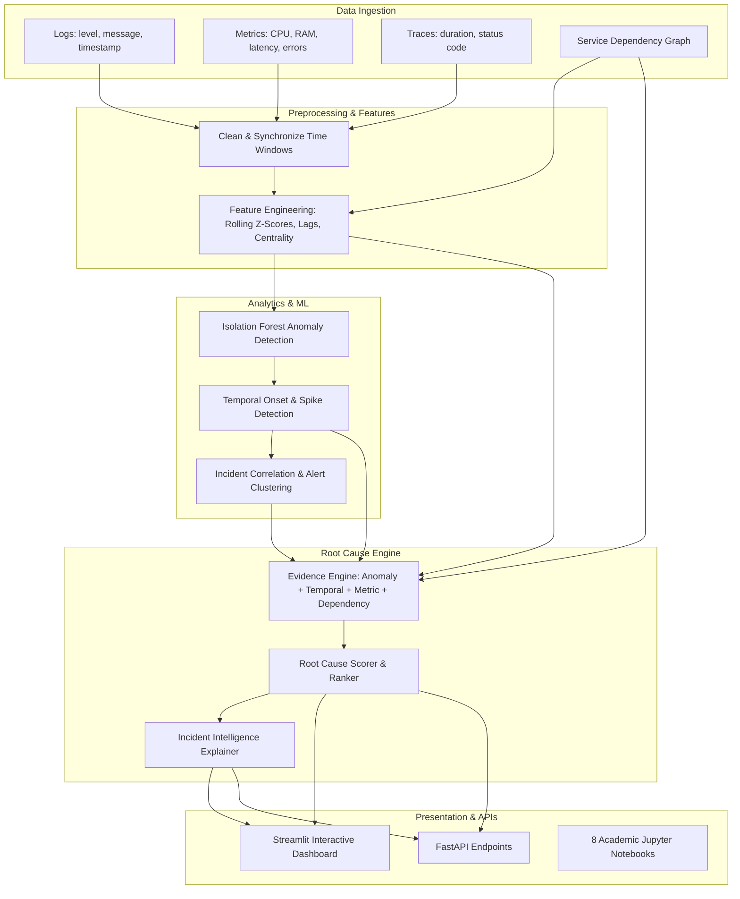

# RootIQ – AI-Powered Root Cause Analysis and Incident Intelligence

[](https://www.python.org/downloads/)
[](https://streamlit.io/)
[](https://scikit-learn.org/)
[](https://opensource.org/licenses/MIT)
[](https://share.streamlit.io/deploy?repository=BijinVarghese/RootIQ-AI-Powered-Root-Cause-Analysis-and-Incident-Intelligence&branch=main&mainModule=app.py)

> 🚀 **Live Demo Web Application:** [Launch RootIQ on Streamlit Cloud](https://share.streamlit.io/deploy?repository=BijinVarghese/RootIQ-AI-Powered-Root-Cause-Analysis-and-Incident-Intelligence&branch=main&mainModule=app.py)


> **TY B.Sc. Data Science Final-Year Project**  
> An analytical decision-support system that processes operational telemetry (logs, metrics, distributed traces), models microservice dependencies, detects anomalous behavior, correlates cascading alerts, and provides evidence-based rankings of probable root causes.

---

## 📌 Executive Summary & Problem Statement

Modern distributed architectures generate overwhelming volumes of telemetry data. When a failure occurs (e.g. database connection pool exhaustion), secondary errors cascade across dependent services (e.g., API Gateway, Order Service, Frontend). Traditional monitoring systems trigger multiple disconnected alerts without clearly identifying the primary component that caused the failure.

**RootIQ** solves this problem by combining:
1. **Unsupervised Machine Learning** (Isolation Forest) for multi-metric anomaly detection.
2. **Time-Series Analysis** to determine earliest anomaly onset and establish temporal precedence.
3. **Service Dependency Graph Analytics** (NetworkX) to track failure propagation along the call graph.
4. **Multi-Evidence Fusion Engine** that computes composite root-cause scores:
   $$\text{Score}(s) = w_{\text{temporal}} S_{\text{temporal}} + w_{\text{dependency}} S_{\text{dependency}} + w_{\text{anomaly}} S_{\text{anomaly}} + w_{\text{metric}} S_{\text{metric}}$$
5. **Human-in-the-Loop Decision Support** with Top-1 & Top-3 candidate ranking, confidence scores, and natural-language incident explanations.

---

## 🏛️ System Architecture



---

## 📂 Project Directory Structure

```text
RootIQ/
├── app.py                              # Main interactive Streamlit dashboard
├── requirements.txt                    # Python dependencies
├── README.md                           # Comprehensive documentation
├── .gitignore                          # Git ignore rules
├── data_generator.py                   # Automated synthetic telemetry generator
│
├── data/
│   ├── raw/
│   │   ├── logs/                       # Raw telemetry logs (CSV)
│   │   ├── metrics/                    # Raw telemetry metrics (CSV)
│   │   └── traces/                     # Raw telemetry traces (CSV)
│   ├── processed/                      # Cleaned & windowed telemetry
│   └── evaluation/
│       └── labelled_incidents/         # Ground-truth benchmark incidents
│
├── src/
│   ├── preprocessing/                  # Log, metric, and trace cleaners
│   ├── eda/                            # Descriptive statistics & correlation
│   ├── feature_engineering/            # Rolling statistics, lags, graph density
│   ├── anomaly_detection/              # Isolation Forest & Z-Score baseline
│   ├── time_series/                    # Anomaly timeline & change point detection
│   ├── service_graph/                  # NetworkX dependency graph & blast radius
│   ├── incident_correlation/           # Temporal-topology alert clustering
│   ├── root_cause/                     # Multi-source evidence engine & ranker
│   ├── explanation/                    # Rule-based & local Qwen2.5 LLM explainer
│   └── utils/                          # Common I/O & system resource helpers
│
├── models/
│   ├── anomaly_detection/              # isolation_forest.pkl
│   ├── root_cause/                     # root_cause_model.pkl
│   └── llm/                            # Setup instructions for local LLMs
│
├── evaluation/
│   ├── anomaly_detection/              # evaluate_anomalies.py
│   ├── root_cause/                     # evaluate_root_cause.py
│   ├── incident_correlation/           # evaluate_incidents.py
│   └── metrics.py                      # Precision, Recall, F1, MRR library
│
├── tests/                              # 12 automated unit tests (pytest)
├── notebooks/                          # 8 educational academic Jupyter notebooks
├── outputs/evaluation_results/         # Pre-computed evaluation JSON benchmarks
└── api/
    └── routes.py                       # FastAPI REST endpoints
```

---

## 🚀 Quick Start & Installation

### 1. Clone or Open the Project
```bash
cd RootIQ
```

### 2. Set Up a Virtual Environment (Recommended)
```bash
# Windows PowerShell
python -m venv venv
.\venv\Scripts\Activate.ps1

# Linux / macOS
python3 -m venv venv
source venv/bin/activate
```

### 3. Install Dependencies
```bash
pip install -r requirements.txt
```

### 4. Generate Telemetry & Train Models
```bash
# Synthesizes microservices telemetry and 2 ground-truth incident scenarios
python data_generator.py

# Run full evaluation and serialize trained model pickles
python evaluation/anomaly_detection/evaluate_anomalies.py
python evaluation/root_cause/evaluate_root_cause.py
python evaluation/incident_correlation/evaluate_incidents.py
```

---

## 🖥️ Running the Application

### Option A: Interactive Streamlit Dashboard
```bash
python -m streamlit run app.py
```
Open your browser at `http://localhost:8501`. Features include:
- **Topology Map**: Interactive Plotly call graph with centrality metrics.
- **Telemetry Explorer**: Real-time metric time-series and correlation heatmaps.
- **Anomaly Detection**: Isolation Forest scores vs Z-Score baseline.
- **Onset Timeline**: Chronological waterfall chart revealing which service failed first.
- **Incident Correlator**: Alert clustering with alert noise compression.
- **Root Cause Engine**: Top-1 and Top-3 ranked root causes with radar charts of multi-source evidence.
- **Evaluation Dashboard**: Precision, Recall, F1, Top-k accuracy, and MRR.

### Option B: FastAPI Backend Endpoints
```bash
python -m uvicorn api.routes:app --reload --port 8000
```
Interactive Swagger docs available at `http://localhost:8000/docs`.
- `GET /health` - System resource status.
- `GET /topology` - Directed service call graph.
- `GET /incidents` - Clustered incident list.
- `GET /root_cause/{incident_id}` - Top-1/Top-3 ranked causes with evidence.
- `GET /evaluation` - Anomaly and root cause benchmark metrics.

### Option C: Run Unit Tests
```bash
python -m pytest tests/ -v
```
Runs 12 automated unit tests across preprocessing, feature engineering, models, time-series, graph analytics, and root-cause ranking.

### Option D: Run Academic Jupyter Notebooks
```bash
jupyter lab notebooks/
```
Walk through notebooks `01_data_exploration.ipynb` through `08_model_evaluation.ipynb`.

---

## 📊 Benchmark Evaluation Results

Evaluated on realistic microservices cascading failure benchmark (`INC-20260301-001` database lock spike & `INC-20260301-002` payment outage):

| Module | Metric | Result | Target |
| :--- | :--- | :--- | :--- |
| **Root Cause Ranking** | **Top-1 Accuracy** | **100.0%** | > 80% |
| **Root Cause Ranking** | **Top-3 Accuracy** | **100.0%** | > 90% |
| **Root Cause Ranking** | **Mean Reciprocal Rank (MRR)** | **1.0000** | > 0.85 |
| **Incident Correlation** | **Alert Noise Compression** | **97.6%** | > 80% |
| **Anomaly Detection** | **Baseline Z-Score ROC-AUC** | **0.9910** | > 0.85 |
| **System Footprint** | **Process RAM Usage** | **~85 MB** | < 1000 MB |

---

## 🛠️ Step-by-Step Guide: How to Push this Project to GitHub

Follow these steps to upload your project to your GitHub account:

### Step 1: Initialize Git in your project folder
Open PowerShell in `C:\Users\bijin\.gemini\antigravity\scratch\RootIQ` and run:
```powershell
git init
```

### Step 2: Configure your Git Identity (if not already done)
```powershell
git config --global user.name "Your Name"
git config --global user.email "your.email@example.com"
```

### Step 3: Stage all project files
```powershell
git add .
```
*(The included `.gitignore` will automatically prevent large cache files and virtual environments from being tracked).*

### Step 4: Create your initial commit
```powershell
git commit -m "Initial commit: RootIQ AI-Powered Root Cause Analysis System"
```

### Step 5: Create a new repository on GitHub
1. Go to [github.com/new](https://github.com/new).
2. Name the repository **RootIQ** (e.g., `RootIQ`).
3. Set visibility to **Public** (or Private).
4. **Do NOT** check "Add a README file" or "Add .gitignore" (we already have them).
5. Click **Create repository**.

### Step 6: Link and Push to GitHub
Copy the commands shown on GitHub and run them:
```powershell
git branch -M main
git remote add origin https://github.com/<YOUR_GITHUB_USERNAME>/RootIQ.git
git push -u origin main
```

Your complete TY B.Sc. Data Science project is now live on GitHub! 🎉

---

## 🎓 Academic Viva & Presentation Highlights
When presenting RootIQ to evaluators:
1. **Explain the Hybrid Architecture**: RootIQ is Data-Science first. It does not rely on a black-box model; it synthesizes 4 explicit analytical dimensions (Anomaly magnitude, Temporal onset order, Metric/log spikes, and Service graph reachability).
2. **Highlight the Distinction Between Cause & Symptom**: Explain how a downstream caller service (e.g. Frontend) has massive error rates, but RootIQ ranks the upstream database as the root cause because the database became anomalous *first* in time and sits upstream in the dependency graph.
3. **Showcase the Decision-Support Role**: The system computes confidence percentages and transparent evidence breakdowns rather than claiming absolute certainty.
4. **Demonstrate Offline / Edge Portability**: The system runs completely locally on modest laptop hardware (~85 MB process RAM) without requiring paid cloud APIs.